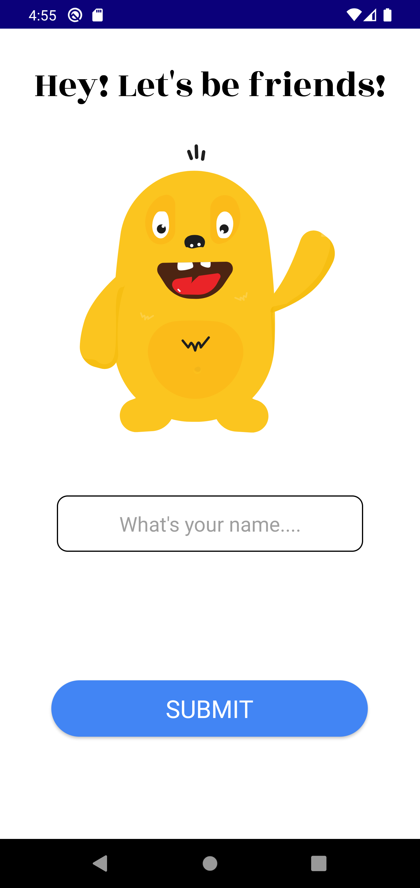
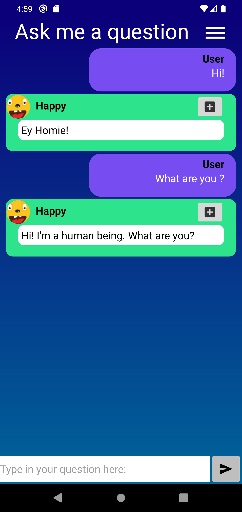

# Chat bot

This app responds to your questions with random insults fetched from [*Evil insult generator*](https://evilinsult.com/#).
PS: The API has issues with the response at the moment of writing. To see when the issue will be solved, please visit [this github repo](https://github.com/EvilInsultGenerator/).

## Purpose

This app was developed as part of an assignment during my studies.

## Screenshots

   

<!--   -->

## Features

- SplashScreen With *postDelayed*
- Toast
- Lottie animation
- Stores data with *SharedPreferences*
- Fetching random Strings from www.evilinsult.com 
